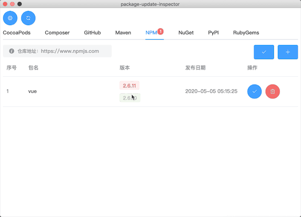
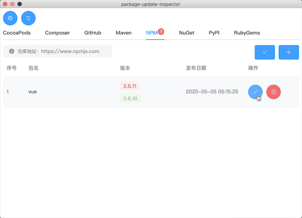
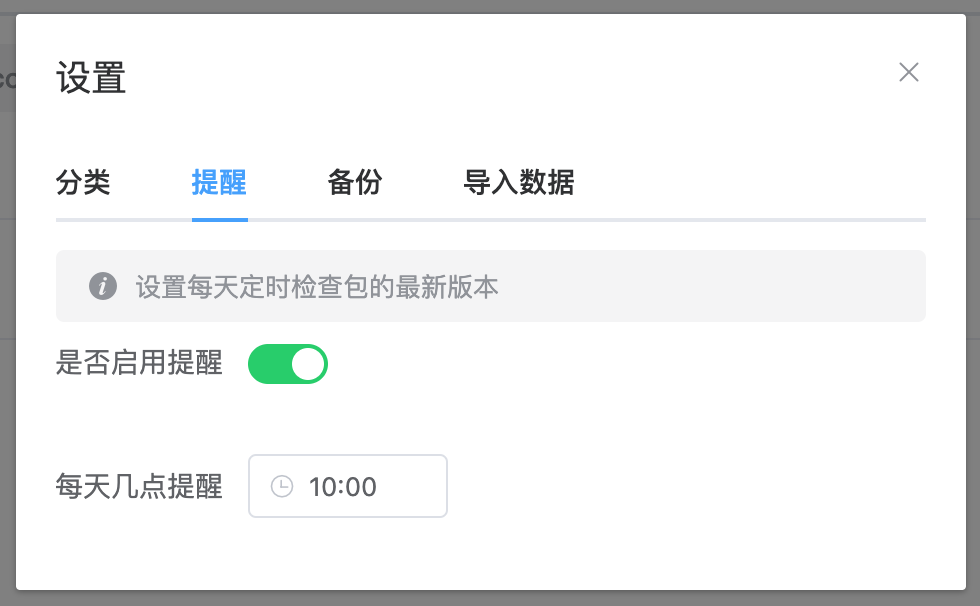
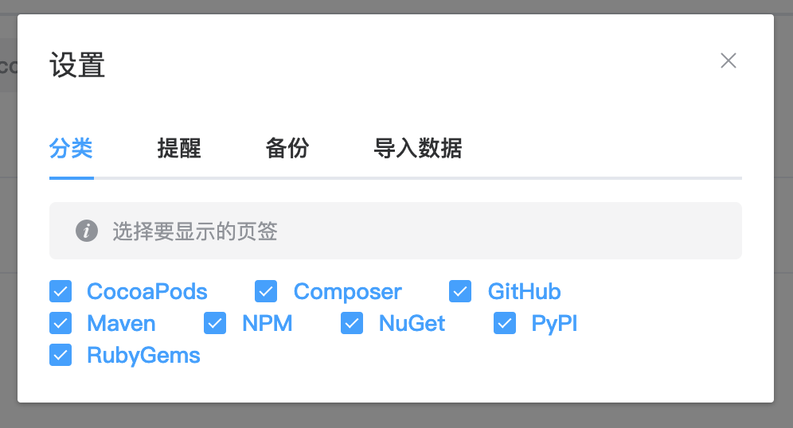
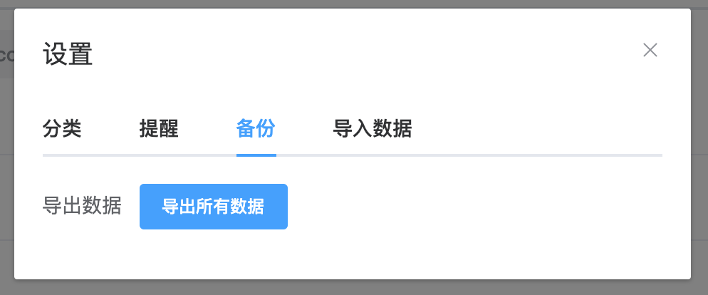
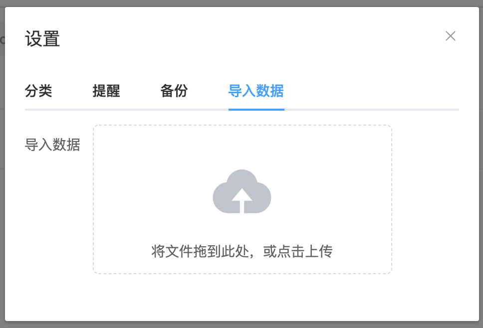

# PackageUpdateInspector 包更新检查器
## 简介
一个开源软件包更新提醒工具，支持多种平台，`Composer`、`GitHub`、`Maven`、`NPM`、`NuGet`。同时也支持`CocoaPods`、`PyPI`、`RubyGems`平台，但受网络限制，超时情况比较频繁。

## 功能介绍
### 添加自己想要监控的包后，可以手动查询有哪些包已更新


### 有更新后，可点击版本，查看包更新详情



### 知晓版本更新后，可点击`对号`，表示已知晓更新



### 除了手动查询，也可以设置每天定时查询



### 设置只查看某些平台



### 支持导出数据



### 支持导入数据



## 开发
### 技术栈
- `vue`
- `vuex`
- `element-ui`
- `axios`
- `cheerio`
- `electron`
- `cron`
- `sqlite3`

### 运行部署
```bash
# 运行
yarn electron:serve
# 构建
yarn electron:build
```
